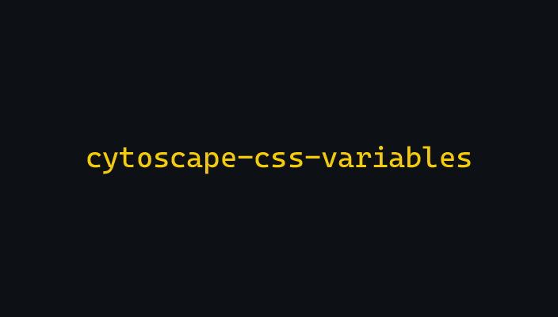
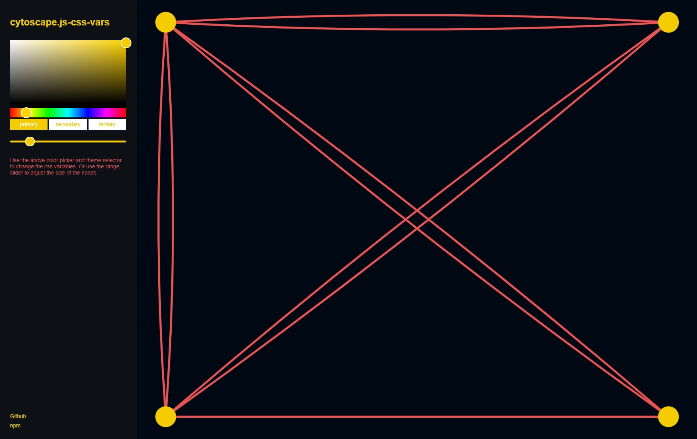

<h1 align="center"> cytoscape-css-variables </h1>
<br>
<p align="center">
  <a href="https://cytoscape-css-variables.netlify.app/">
    
  </a>
</p>
<p align="center">
  Add CSS Variable functionality to Cytoscape graphs
</p>

## 🎨 Example

[](https://cytoscape-css-variables.netlify.app/)

## 📦 Install

Download the library:
 * via npm: `npm install cytoscape-css-variables`,
 * via unpkg: `https://unpkg.com/cytoscape-css-variables/dist/cytoscape-css-variables.js`

Import the library as appropriate for your project:

ES import:

```js
import cytoscape from 'cytoscape';
import cssVars from 'cytoscape-css-variables';

cytoscape.use( cssVars );
```

CommonJS require:

```js
let cytoscape = require('cytoscape');
let cssVars = require('cytoscape-css-variables');

cytoscape.use( cssVars ); // register extension
```

AMD:

```js
require(['cytoscape', 'cytoscape-css-variables'], function( cytoscape, cssVars ){
  cssVars( cytoscape ); // register extension
});
```

Plain HTML/JS has the extension registered for you automatically, because no `require()` is needed.


## 🔥 API

```javascript
// core cytoscape instance
let cy

// cssVars extension instance
let css_vars

// Can't call css_vars before it is initiated, so declaring the function here
const getVar = (variable) => (css_vars ? css_vars.getVar(variable) : null)

cy = cytoscape({
  container: document.getElementById('cy'),
  style: [
    {
      selector: 'node',
      style: {
        // Use getVar() with the css variable name to use it
        // - this can be used for more than just colors
        // - getVar() here is a local function, NOT the extension function
        'background-color': () => getVar('--theme-primary'),
      },
    },
  ],
  // your array elements go here
  elements: [],
})

// cssVars takes two (optional) values,
// initialVars object and the domEl to assign the vars to/from
cy.cssVars({
  initialVars: {
    '--theme-primary': 'rgb(245, 204, 0)',
    '--theme-secondary': 'rgb(0, 8, 20)',
    '--theme-tertiary': 'rgb(234,84,85)',
    '--cy-node-size': 30,
  },
  domEl: document.body,
})

// no updates will be made until update() is called (even on init)
// this allows you to bulk change css vars but only run one update
// NOTE: this will need to be run after any set of set/get/remove functions
css_vars.update()

// assigns a value to a variable
css_vars.setVar('--theme-primary', 'rgb(245, 204, 0)')

// removes a variable and its value by the variable name
css_vars.removeVar()

// returns an object of css variables and their values
// will match the initialVars object to be passed in on init
css_vars.getVars()

// bulk add variables
// will match the initialVars object to be passed in on init
css_vars.addVars()

// removes all variables and their values
css_vars.resetVars()

// sets the current active DOM element
css_vars.setDomEl()

```